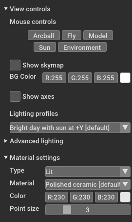

Exploring the GUI Functionality
===============================

This example GUI is based on Python code. Before examining the Python code, try out the functions that this tutorial will explain so you can understand what the GUI does. 
Look at the control panel on the right side of the window.

.. _show_x_y_and_z-axis:

Show X, Y, and Z Axes
---------------------

Below the words "Mouse controls", "Show skymap", and "BG Color", you will see a check box next to the words "Show axes". 
Click on the **Show axes** checkbox to select it.

You will see a green and a red line and a blue dot in the center of the model. These represent the Y-axis, X-axis, and Z-axis, respectively. The remainder of the tutorial will continue to show the axes for consistency.

