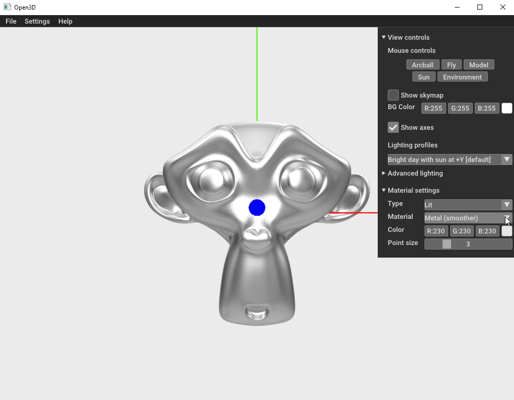

Other Parts of GUI Control Panel
================================

.. note:: 
    For the sake of consistency, you will need to reopen the file at the beginning of each of the following tutorial sections.

Mouse Controls-Fly
------------------

We will test the mouse controls. The default control when you first load a model is **Arcball**. You have already discovered how that works. 
Now, we will play with the **Fly** mouse control.

Click on the **Fly** button under the words "Mouse controls" at the top of the control panel. Then, click anywhere on the model and keep the button down. Move the mouse up and down as precisely as possible. The movement is a bit more complex than before. 
Think of a 3D sphere pictured on your 2-dimensional screen in front of the model. The imaginary sphere is several times larger than the model in its radius. Only part of it fits on the screen. This sphere rotates when you move the mouse. The model’s relative orientation changes with its point on the sphere, like a fly walking on a globe. 
The mouse movements make the model move as if you are rolling the ball in place, and the model stays attached in the same place to the back of the invisible sphere. If you slide the mouse up, for example, the bottom of the model (at least in the original orientation) slowly rotates toward you. 

.. image:: images/Python-Open3D-Examples-Gui-mouse-fly-up.png
  :width: 300
  :alt: Alternative text

If you move the mouse down, the top of the model rotates towards you slowly.

.. image:: images/Python-Open3D-Examples-Gui-mouse-fly-down.png
  :width: 300
  :alt: Alternative text

Left and right mouse movements do the same rotating in the opposite direction of the mouse movement. With each new mouse movement, the imaginary sphere starts out with the middle of the model in that orientation with the model on the farthest possible point on the sphere away from you. 

Mouse Controls-Model
--------------------

The **Model** mouse control does exactly the same thing as the **Arcball** control except that the axes stay stationary. Click on the **Model** button.  Then, click on a point on the model or anywhere on the window and hold down the mouse button. Move the mouse up, down, left, right, and diagonally and see how the model moves. You will notice the model moves while the axes remain stationary.
 

Mouse Controls-Sun
------------------

As before, open the monkey.obj file. Click on the **Sun** button. Then, click and hold down the mouse button on any point on the Open3D window (other than the control panel). You will see a sphere with a lattice structure. The pole of the sphere is centered on the blue point of the Z-axis. A yellow circle represents the sun, and a thick yellow line shows the direction of light from the sun. Continue holding down the mouse button as you move the mouse down and to the right.
When you move the mouse while holding down the mouse button, you move the pole of the sphere, and you rotate the sun’s orientation accordingly. 

Mouse Controls-Environment
--------------------------

Click on the **Environment** button. Then, click anywhere on the window (except the control panel). You will see a grey and blurry 3D environment in the background. Continue holding down the mouse button and move the mouse up and to the right. The model will not change orientation, but the 3D environment surrounding it will. You will see what looks like ceiling lights in the background. 
 

Show Skymap
-----------

For this section you don’t need to open the monkey.obj file again. Click on the checkbox for **Show skymap**. While this is checked, you again see the same blurry 3D environment that you saw with the Environment mouse control. So instead of only seeing it when the mouse button is held down, you see it constantly.
Click this checkbox off before moving to the next section.

Lighting profiles
-----------------

Click on the dropdown menu below the words "Lighting profiles". Select "Bright day with sun at +Z". The light will come from behind the model towards the blue dot at the end of the Z-axis. You will also notice that the shadows are different due to the light direction.
 

Select each of the other choice from the **Lighting profiles** dropdown to see how the model looks with the light coming from different directions. 
Finally, go back to the default, “Bright day with sun at Y+”.

Advanced Lighting
-----------------

Click on the right arrow next to “Advanced Lighting”. The control panel will expand to show more lighting options. 

.. image:: images/Python-Open3D-Examples-Gui-image-3.png
  :width: 300
  :alt: Alternative text

Lighting Sources
----------------

Click on the checkbox to deselect **HDR map**. Deselecting **HDR map** makes the model a charcoal grey color. 

.. image:: images/Python-Open3D-Examples-Gui-advanced-lighting-hdr-deselected.png
  :width: 300
  :alt: Alternative text 

While **HDR map** is deselected, click on the checkbox to deselect **Sun**. Now, the model will be completely black.

If you again select **HDR map** and deselect **Sun**, the shading will change very subtly.
 

Click on the **Sun** checkbox again to select it. Change the **HDR map** dropdown menu to "Crossroads". With this selection, the model and its shadows take on a yellowish tinge. 
 

Try other selections in the **HDR map** dropdown list. Then, select “Default” from the HDR map dropdown list to go back to the original setting.

HDR Intensity
-------------

Click and drag the slider for **Intensity** (HDR map) right to increase it and left to decrease it. Try increasing it to the maximum intensity and see what happens. As you might expect, at 200,000 in intensity, the model gets all white with no shadows. 

Now, try decreasing the **Intensity** (HDR map) to 0. This decrease makes the model look the same charcoal grey as when the **HDR** checkbox is deselected.
Attempt to put the slider back at 45,000 or at least as close to it as you can.

Sun Intensity
-------------

Another control in the Advanced Lighting settings, the sun intensity also has a slider that goes from 0 to 200,000. Next to the words “Sun”, the control panel has in parenthesis “(Directional Light)”. 
Even at the extremes, changes in the **Intensity** (Sun) slider are more subtle. Increase the intensity on the slider to the maximum. This sun intensity increase shrinks the shadows around the eyes and nose but increases them around the cheeks.
 

Slide the **Intensity** (Sun) down to zero. As expected, the model has the same appearance as when the **Sun** checkbox is deselected. 
Try to put the **Intensity** (Sun) slider back as close to 45,000 as possible.

Light Direction
---------------

It is not entirely clear what the different numbers do in terms of direction. It might seem that the directions are in terms of X, Y, and Z components of the corresponding angle. This may or may not be the case.  
Changes in the numbers make miniscule changes in the light and shadows. And changes in the **Lighting profiles** dropdown menu makes changes in the direction, but not as you might expect if they were X, Y, and Z components. Oddly the inverse tangent of 0.577, the default for the first value, happens to be 30⁰. In any case the GUI allows you to input the three direction components. 
Make the three components 0, 0, and 0.  This apparent elimination of direction makes the light and shadows change substantially.

The color picker, **Color** (Sun) can be changed to any color you select. However, this change does not seem to do anything to the color of light from the sun in the model.
If you do select a color from the color picking palette, you must click on another portion of the control panel to for your color selection to take effect in the square tile that shows the color.

Material Settings
-----------------

From the **Type** dropdown menu ou can select the type of material as “Lit”, “Unlit”, “Normals”, and “Depth”. Try each of these. If you select “Normals”, the model’s coloring will change to light purple with a light green forehead. 
 

When you are finished trying the material types, change the material type back to “Lit”.

Material
--------

The GUI allows you to change the **Material** dropdown list (separate from the **Type** dropdown). I suggest you try each choice. “Polished Ceramic (default)”, “Glazed Ceramic”, “Clay”, and “Plastic” look similar.  
Then, change the **Material** dropdown list to “Metal (smoother)”.

 
Change the **Material** dropdown back to “Polished ceramic (default)”.

Material Color
--------------

Like the sun’s color, the material’s color can be changed with an RGB color picker, **Color** (Material). The default is 230, 230, 230.
Change the color in the color picker to whatever you want. Then click on a separate portion of the control panel to stop displaying the RGB color picker. 

 
Now, go back to the **Material** dropdown and change it to “Metal (smoother)”. 

Change the **Material** dropdown to “Polished ceramic (default)”, and change the color back to 255, 255, 255 or close to it with the **Color** (Material) color picker. 

Point Size
----------

Another aspect of the model that you can change is the point size. The **Point size** slider ranges from 1 to 10. As you increase the point size from the default 3 down to 1 you will notice a slightly less pixelated and smoother edges. If you however change the point size up to 10, you see a significantly more pixelated edges. 

Python and Open3D Examples GUI
------------------------------

As you might expect, the Open3D API allows you to do these same model manipulations with Python. Look at the /examples/python/gui/vis-gui.py file in your favorite code editor. You will notice that some of the settings such as Lighting_profiles are set to a JSON, making the model manipulation significantly easier for coders.
While doing these alterations of the model in Python are certainly possible, they are beyond the scope of this tutorial. 

Looking at the Python in more detail will be left for future tutorials.

